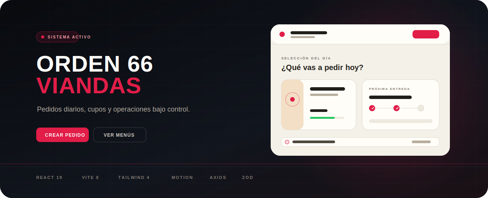
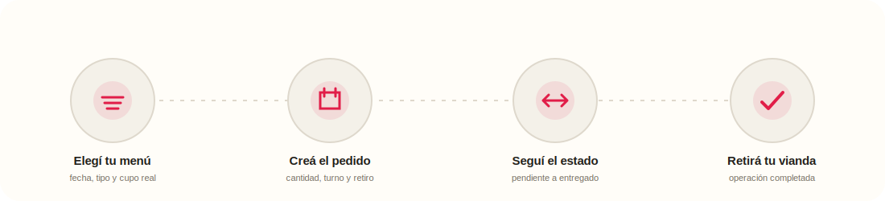
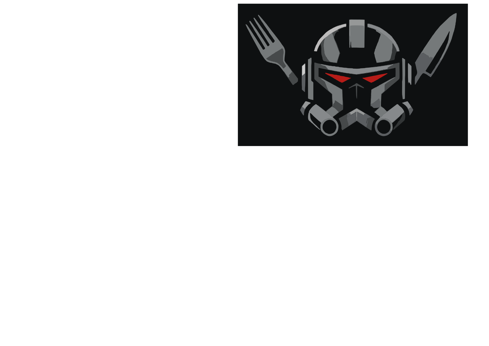

<div align="center">
  

  <br />

  

  # Orden 66 Viandas

  **Una experiencia moderna para elegir viandas, gestionar pedidos y operar cupos diarios.**

  [](https://react.dev/)
  [](https://vite.dev/)
  [](https://tailwindcss.com/)
  [](https://motion.dev/)

  [](#comandos)
  [](#comandos)
  [](#experiencia)
</div>

---

## El producto

**Orden 66 Viandas** es el frontend de una aplicación full-stack para administrar pedidos de comida con disponibilidad diaria, roles y seguimiento de estados.

El diseño combina una navegación oscura inspirada en un centro de comando con un workspace cálido, cómodo y profesional. La temática aporta identidad; la UX sigue siendo la prioridad.



## Experiencia

| Para usuarios | Para administración |
|---|---|
| Explorar menús por fecha y tipo | Supervisar todos los pedidos |
| Consultar precio y cupo disponible | Filtrar por fecha y estado |
| Crear, editar y cancelar pedidos | Confirmar, cancelar y entregar |
| Seguir el estado de cada orden | Consultar resumen operativo |
| Revisar detalle e historial | Auditar historial de cambios |
| Gestionar perfil y seguridad | Operar con acciones contextuales |

### Detalles cuidados

- Paleta híbrida con identidad propia y alto contraste.
- Flujo responsive para desktop, tablet y mobile.
- Loading, error y empty states en pantallas conectadas a API.
- Formularios con React Hook Form, Zod y errores inline.
- Animaciones breves con Motion y soporte para `prefers-reduced-motion`.
- Paginación, filtros combinables y acciones según rol/estado.
- Rutas lazy-loaded para reducir la carga inicial.

## Stack

| Capa | Tecnología |
|---|---|
| UI | React 19, Tailwind CSS 4, shadcn/ui, Lucide |
| Navegación | React Router 7 |
| Formularios | React Hook Form + Zod |
| Datos | Axios + services y hooks por feature |
| Movimiento | Motion |
| Feedback | Sonner |
| Tooling | Vite 8 + ESLint 10 |

## Arquitectura

```text
src/
├── components/ui/          # Primitivas visuales reutilizables
├── context/                # Sesión y autenticación
├── features/
│   ├── landing/            # Presentación pública
│   ├── auth/               # Login y registro
│   ├── dashboard/          # Inicio del usuario
│   ├── menus/              # Catálogo y cupos
│   ├── pedidos/            # Flujo completo de órdenes
│   ├── perfil/             # Cuenta y preferencias
│   └── admin/              # Operaciones administrativas
├── lib/                    # Axios, errores y utilidades
├── router/                 # Rutas públicas y protegidas
└── shared/                 # Shell, navegación y feedback
```

Cada feature mantiene sus propias páginas, componentes, hooks y services. El backend continúa siendo la fuente de verdad para permisos, cupos y transiciones de estado.

## Puesta en marcha

### Requisitos

- Node.js 20 o superior
- npm
- Backend de Viandas ejecutándose localmente

### Instalación

```bash
git clone https://github.com/Aznar-7/ViandaApp_Front.git
cd ViandaApp_Front
npm install
```

Crear `.env.local`:

```env
VITE_API_URL=http://localhost:3000/api
```

Iniciar el entorno:

```bash
npm run dev
```

La aplicación queda disponible por defecto en `http://localhost:5173`.

## Comandos

```bash
npm run dev       # servidor de desarrollo
npm run build     # build optimizado de producción
npm run preview   # previsualizar el build
npm run lint      # validar calidad del código
```

## Rutas principales

| Ruta | Acceso | Descripción |
|---|---|---|
| `/` | Público | Landing de presentación |
| `/login` y `/register` | Público | Autenticación |
| `/dashboard` | Usuario | Selección diaria y próximo pedido |
| `/menus` | Usuario | Menús y cupos disponibles |
| `/pedidos` | Usuario | Historial y seguimiento |
| `/perfil` | Usuario | Perfil y seguridad |
| `/admin` | Admin | Centro operativo |

## API y diseño

- El contrato consumido por el frontend está documentado en [FRONTEND_API.md](./FRONTEND_API.md).
- Las decisiones visuales y de UX viven en [ORDEN66_UI_GUIDELINES.md](./ORDEN66_UI_GUIDELINES.md).
- Las mejoras futuras y deuda conocida están registradas en [PLAN_MEJORAS.md](./PLAN_MEJORAS.md).

## Identidad visual

<div align="center">
  
</div>

La identidad es una interpretación original de un sistema futurista de provisiones. El producto evita depender de personajes, imágenes o recursos externos para sostener su personalidad.

---

<div align="center">
  <strong>Diseñado y construido para que pedir una vianda sea rápido, claro y memorable.</strong>
  <br />
  <sub>Orden 66 Viandas · Frontend React</sub>
</div>
